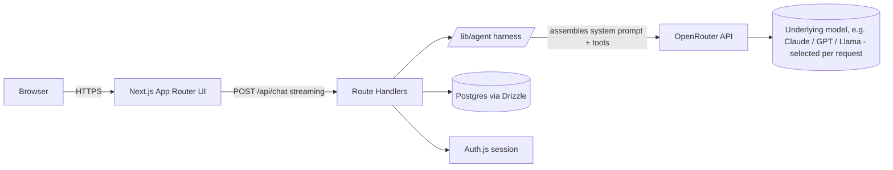

# ARCHITECTURE.md

## 1. System overview



**Key principle:** the browser never talks to OpenRouter directly, and never sees the system prompt. Everything goes through our Route Handlers, which own the harness. OpenRouter itself is just a model gateway — it doesn't change this principle, it just means "the LLM provider" is now a configurable choice rather than a single hardcoded vendor.

## 2. Component responsibilities

### Frontend (`/app`, `/components`)
- Renders chat UI, message list, input box, streaming tokens
- Uses `@ai-sdk/react`'s `useChat` for streaming state management
- Knows nothing about system prompts, tools, or the Anthropic API directly
- Talks only to our own `/api/*` endpoints

### API layer (`/app/api`)
- Thin. Validates requests, checks auth session, calls into `/lib/agent`, streams the response back, persists messages to DB.
- `POST /api/chat` — the core streaming endpoint
- `GET/POST /api/conversations` — list/create conversations
- `GET /api/conversations/:id` — fetch a conversation's messages
- `DELETE /api/conversations/:id` — delete a conversation
- Auth.js routes under `/api/auth/*`

### Harness (`/lib/agent`) — the actual product
- `systemPrompt.ts`: builds the final system prompt (base instructions + any per-conversation persona/config). Versioned so we can track prompt changes over time.
- `harness.ts`: the orchestration loop. Sends messages to OpenRouter (model chosen via `OPENROUTER_MODEL` env var, e.g. `anthropic/claude-sonnet-4.5` or `openai/gpt-5`), handles streaming, and — once we reach Phase 4 — handles tool-call/tool-result round-trips. Model choice is a config value, not something baked into the harness logic, so swapping models for experimentation costs one env var change.
- `tools/`: individual tool definitions (Phase 4+), e.g. a calculator, a web search stub, etc. Each tool is a pure function with a JSON schema description.
- **This folder has zero Next.js imports.** It should be extractable into a standalone service with no changes if we ever split the backend out.

### Database (Postgres + Drizzle)
Initial schema (Phase 2):

```
users
  id (uuid, pk)
  email (text, unique)
  created_at

conversations
  id (uuid, pk)
  user_id (fk -> users.id)
  title (text)
  system_prompt_version (text)   -- which prompt version this convo used
  created_at
  updated_at

messages
  id (uuid, pk)
  conversation_id (fk -> conversations.id)
  role (enum: user | assistant | tool)
  content (text / jsonb for structured content)
  created_at
```

This is intentionally minimal — we add `tool_calls`, `attachments`, etc. only when a phase actually needs them. Don't design for hypothetical future features.

### Auth (Auth.js)
- Phase 3 adds this. Until then, the app runs single-user / no-auth for local dev simplicity.
- Session cookie → server-side session lookup → attaches `user_id` to DB queries.

## 3. Decision log (ADRs)

**ADR-001: Monolith (Next.js API routes) over separate backend service**
- Context: learner is frontend-strong, backend-learning.
- Decision: keep backend inside Next.js initially.
- Consequence: faster to build, less context-switching. Risk of coupling is mitigated by isolating harness logic in a framework-agnostic `/lib/agent` folder, so extraction later is a lift, not a rewrite.

**ADR-002: Drizzle over Prisma**
- Context: goal is to *learn* relational modeling, not just consume an ORM.
- Decision: Drizzle, which is closer to raw SQL and doesn't hide query shape.
- Consequence: slightly more boilerplate; significantly more learning value.

**ADR-003: Vercel AI SDK for streaming**
- Context: SSE streaming + token-by-token UI state is genuinely fiddly to hand-roll and is a solved problem.
- Decision: use `ai` / `@ai-sdk/react` for the transport layer; keep prompt/harness logic ours.
- Consequence: we don't reinvent streaming plumbing, but the actual "product" (harness, system prompt, tools) remains fully custom.

**ADR-004: Postgres (Neon) over SQLite/other**
- Context: want a DB that mirrors what's used in real production systems, with painless free hosting.
- Decision: Neon serverless Postgres.
- Consequence: real-world relevant skills, zero local DB setup friction.

**ADR-005: OpenRouter over a direct Anthropic API integration**
- Context: original plan was to call the Anthropic API directly. Decision changed to use OpenRouter instead.
- Decision: use OpenRouter (`@openrouter/ai-sdk-provider`, the official Vercel AI SDK provider for it) as the LLM gateway. One API key, 300+ models available, model chosen by a string identifier like `anthropic/claude-sonnet-4.5` or `openai/gpt-5`.
- Rationale:
  - **Model flexibility for a learning project** — you can A/B different models against the same harness without touching code, which is genuinely useful while you're still deciding what "your" assistant should feel like.
  - **Single billing/API surface** instead of juggling multiple provider accounts if you ever want to compare models from different vendors.
  - **Still fully OpenAI-compatible under the hood**, so nothing about our harness abstraction (`/lib/agent`) changes — OpenRouter is just the concrete implementation swapped into the same interface.
- Trade-offs (be aware of these, don't ignore them):
  - **Extra network hop** — OpenRouter sits between us and the underlying model provider, adding a small amount of latency vs. calling Anthropic directly.
  - **Feature parity lag** — provider-specific features (e.g. Anthropic prompt caching) are supported through `providerOptions.openrouter`, but new features from a given model vendor may land on OpenRouter slightly after they land on that vendor's native API.
  - **Another dependency in the chain** — if OpenRouter has an outage, we're down even if the underlying model provider isn't. Acceptable for a learning project; would need re-evaluation for a production SLA-bound product.
- Env vars: `OPENROUTER_API_KEY` (server-only), `OPENROUTER_MODEL` (default model identifier, overridable per environment).

## 4. Security notes
- `OPENROUTER_API_KEY` lives in server env vars only (`.env.local`, never committed).
- System prompt assembled server-side; never sent to client, never logged in client-visible network requests.
- Rate limiting to be added in Phase 5 (per-user request throttling) to avoid runaway API costs.
- Treat all user input as untrusted when it's included in the harness loop — no string-concatenating user input into anything that gets `eval`'d or shell-executed.
