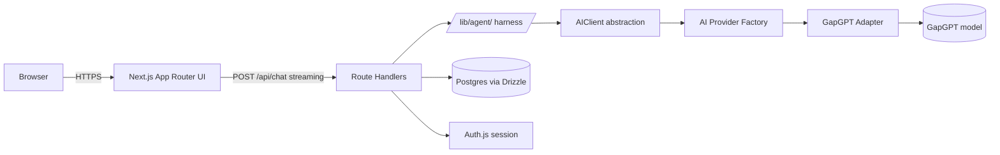

# ARCHITECTURE.md

## 1. System overview



### Current runtime path

```text
Browser
  ↓
src/app
  ↓
POST /api/chat
  ↓
lib/agent/harness.ts
  ↓
AIClient
  ↓
AI Provider Factory
  ↓
GapGPT adapter
  ↓
GapGPT API
  ↓
glm-4-flash
```

### Key principles

The browser never talks to an AI provider directly.

The browser never receives the system prompt.

The browser communicates only with our own Next.js Route Handlers.

Provider-specific implementation details stay behind the `AIClient` abstraction.

The agent/harness layer does not know which AI provider is being used.

The currently active provider is GapGPT. Additional providers are **not implemented unless the application actually needs them**.

The database and authentication layers are server-side concerns and are never exposed directly to Client Components.

---

# 2. Repository structure

The repository intentionally separates application code from server-side infrastructure:

```text
/
├── lib/
│   ├── agent/
│   │   ├── harness.ts
│   │   ├── systemPrompt.ts
│   │   └── prompts/
│   │       └── tutor.ts
│   │
│   ├── ai/
│   │   ├── adapters/
│   │   │   └── gapgpt.ts
│   │   ├── client.ts
│   │   ├── factory.ts
│   │   ├── index.ts
│   │   └── types.ts
│   │
│   ├── auth/
│   │   └── current-user.ts
│   │
│   └── db/
│       ├── client.ts
│       └── schema.ts
│
├── src/
│   ├── app/
│   │   ├── api/
│   │   │   ├── chat/
│   │   │   │   └── route.ts
│   │   │   ├── conversations/
│   │   │   │   ├── route.ts
│   │   │   │   └── [id]/
│   │   │   │       └── route.ts
│   │   │   └── auth/
│   │   │       └── [...nextauth]/
│   │   │           └── route.ts
│   │   ├── auth/
│   │   │   ├── signin/
│   │   │   │   └── page.tsx
│   │   │   └── error/
│   │   │       └── page.tsx
│   │   ├── page.tsx
│   │   └── layout.tsx
│   │
│   ├── components/
│   │   ├── chat/
│   │   │   └── chat.tsx
│   │   ├── layout/
│   │   │   ├── app-shell.tsx
│   │   │   ├── app-sidebar.tsx
│   │   │   └── user-menu.tsx
│   │   └── ui/
│   │       └── ...
│   │
│   ├── hooks/
│   │   └── use-mobile.ts
│   │
│   └── lib/
│       └── utils.ts
│
└── drizzle/
    └── ...
```

### Separation rules

`src/` contains application/UI code.

Root `lib/` contains server-side domain and infrastructure code.

`lib/agent/` contains agent/application logic.

`lib/ai/` contains the provider abstraction and concrete AI integrations.

`lib/auth/` contains authentication utilities and server-side session boundaries.

`lib/db/` contains database access.

`src/lib/` is reserved for frontend/application utilities such as shadcn's `utils.ts`.

---

# 3. Component responsibilities

## Frontend (`/src/app`, `/src/components`)

Responsibilities:

* Render the chat UI
* Render messages
* Render streaming state
* Handle user input
* Use `@ai-sdk/react` for chat state and transport
* Communicate only with our `/api/*` endpoints

The frontend must not know about:

* AI provider API keys
* System prompts
* Provider-specific model identifiers
* Database credentials
* Drizzle
* Auth.js internals

The current chat UI is intentionally simple. It is primarily a test surface for the backend and streaming architecture.

### Current UI implementation status

| Component | Status | Notes |
|-----------|--------|-------|
| Chat message rendering | ✅ Working | Streams and displays messages via `useChat` |
| Streaming indicator | ✅ Working | Shows "Thinking..." during generation |
| Error display | ✅ Working | Shows error bubble on failure |
| Input + send | ✅ Working | Textarea with Enter-to-send, disabled during streaming |
| Attachment button | 🔴 Mocked | Button exists but no file upload implementation |
| Sidebar (conversation list) | 🟡 Partial | UI complete but backed by `MOCK_HISTORY` static data |
| Sidebar search | 🔴 Mocked | Input exists but no search API or filtering |
| New Chat button | 🔴 Mocked | Button exists but doesn't call API |
| Conversation items | 🟡 Partial | Rename/Delete dropdown exists but not wired to API |
| User menu | 🟡 Partial | UI complete but shows static "Jane Doe" data |
| Settings/Upgrade items | 🔴 Mocked | Menu items exist but no backend |

---

## API layer (`/src/app/api`)

Route Handlers are intentionally thin.

Responsibilities:

* Validate incoming requests
* Resolve authentication/session state
* Resolve the current user
* Resolve/create conversations
* Persist messages
* Call the agent harness
* Stream the assistant response back to the client

### Current endpoints

```text
POST   /api/chat                    ✅ Fully implemented with persistence
GET    /api/conversations           ✅ Lists authenticated user's conversations
POST   /api/conversations           ✅ Creates new conversation
GET    /api/conversations/:id       ✅ Fetches conversation metadata
DELETE /api/conversations/:id       ✅ Deletes conversation (with ownership check)
GET/POST /api/auth/[...nextauth]    ✅ Auth.js handlers
```

### Authentication endpoints

Auth.js provides:

```text
/api/auth/*
/auth/signin
/auth/error
```

All authentication endpoints are implemented and working with GitHub OAuth.

The API layer is not responsible for knowing how an AI provider works. It calls the harness and consumes the resulting AI SDK stream.

---

# 4. Agent (`/lib/agent`)

The agent layer represents the application-specific AI behavior.

## `systemPrompt.ts`

Responsibilities:

* Select the active persona
* Build the final system prompt
* Validate persona IDs
* Track prompt versions

Current persona:

```text
tutor
```

Current prompt version:

```text
v1
```

The system prompt is constructed server-side and is never sent to the browser as application data.

---

## `harness.ts`

The harness is the orchestration boundary.

Current responsibilities:

* Convert UI messages into model messages
* Resolve the application-level model (`chat`)
* Send the request through `AIClient`
* Configure generation limits
* Pass through the request abort signal
* Return the AI SDK stream result

Current flow:

```text
UIMessage[]
    ↓
convertToModelMessages()
    ↓
AIClient.streamText()
    ↓
AI SDK stream result
```

### Important provider boundary

`harness.ts` must not import:

```text
@openrouter/*
@portkey/*
@ai-sdk/google
@ai-sdk/groq
```

or any other concrete provider SDK.

It depends only on our internal AI abstraction.

This keeps provider infrastructure replaceable without changing the agent logic.

### Future Phase 4 responsibilities

When the harness is upgraded:

```text
Model
  ↓
Tool Call
  ↓
Tool Execution
  ↓
Tool Result
  ↓
Model
  ↓
Final Response
```

The orchestration loop remains owned by our application rather than being delegated to a high-level SDK agent primitive.

---

# 5. AI infrastructure (`/lib/ai`)

The AI layer provides the provider abstraction.

## Contract

```text
lib/ai/types.ts
```

The application-level contract defines:

```text
AIClient
AIModelId
AIStreamTextParams
AIStreamTextResult
```

The application uses logical model IDs rather than provider-specific identifiers.

Current logical model:

```text
chat
```

The application therefore does not contain:

```text
glm-4-flash
```

Provider-specific model identifiers belong inside the adapter.

---

## Provider factory

```text
lib/ai/factory.ts
```

The factory is the composition root for AI providers.

Current configuration:

```env
AI_PROVIDER=gapgpt
```

The factory resolves:

```text
AI_PROVIDER
    ↓
GapGPTAIClient
```

When another provider is genuinely required, it can be added here without changing the harness.

Do not implement unused providers purely for architectural completeness.

---

## GapGPT adapter

```text
lib/ai/adapters/gapgpt.ts
```

This is the only layer that knows about the current GapGPT integration.

Responsibilities:

* Read `GAPGPT_API_KEY`
* Configure the GapGPT API endpoint
* Map the logical model ID to the GapGPT model
* Adapt the provider to the internal `AIClient` contract
* Call AI SDK `streamText()`

Current mapping:

```text
application model
       chat
        ↓
GapGPT adapter
        ↓
glm-4-flash
```

Current endpoint:

```text
https://api.gapgpt.app/v1
```

Provider credentials remain server-only.

---

# 6. AI SDK

Vercel AI SDK is used as the transport and model abstraction layer.

Responsibilities currently delegated to AI SDK:

* Model invocation
* Message conversion
* Text streaming
* Stream result handling
* UI message stream conversion
* Client-side streaming state through `useChat`

The application does **not** delegate its product-level agent behavior to an AI SDK high-level agent primitive.

This preserves the learning goal of understanding the harness and later implementing tool orchestration explicitly.

---

# 7. Database (`/lib/db`)

Database:

```text
Neon Postgres
```

ORM/query layer:

```text
Drizzle
```

## `lib/db/schema.ts`

Current domain model:

```text
users
accounts          (Auth.js)
sessions          (Auth.js)
verification_tokens (Auth.js)
conversations
messages
```

### Current shape

```text
users
  id              uuid, primary key
  email           text, unique
  name            text, nullable
  email_verified  timestamp, nullable
  image           text, nullable
  created_at      timestamp

accounts          (Auth.js standard tables)
  user_id         uuid, FK → users.id (cascade delete)
  type            text
  provider        text
  provider_account_id text
  refresh_token   text, nullable
  access_token    text, nullable
  expires_at      integer, nullable
  token_type      text, nullable
  scope           text, nullable
  id_token        text, nullable
  session_state   text, nullable
  PK: (provider, provider_account_id)

sessions          (Auth.js standard tables)
  session_token   text, primary key
  user_id         uuid, FK → users.id (cascade delete)
  expires         timestamp

verification_tokens (Auth.js standard tables)
  identifier      text
  token           text
  expires         timestamp
  PK: (identifier, token)

conversations
  id                    uuid, primary key
  user_id               uuid, FK → users.id
  title                 text, nullable
  system_prompt_version text, not null
  created_at            timestamp
  updated_at            timestamp
  index: conversations_user_id_idx

messages
  id               uuid, primary key
  conversation_id  uuid, FK → conversations.id (cascade delete)
  role             message_role enum (user, assistant, tool)
  content          jsonb
  created_at       timestamp
  index: messages_conversation_id_idx
```

Message roles currently are:

```text
user
assistant
tool
```

`tool` exists in the schema for the future harness/tool-calling phase. It is not currently used by the MVP.

The message `content` field is JSONB because messages are treated as structured data rather than plain text.

Additional entities such as attachments or tool-call-specific tables should only be introduced when an actual phase requires them.

---

## `lib/db/client.ts`

Responsibilities:

* Create the server-side Drizzle/Postgres client
* Read `DATABASE_URL`
* Configure the Neon pooler correctly
* Provide database access to server-side code

The database client must never be imported from:

* Client Components
* browser code
* shared modules that can enter a client bundle

Database credentials are server-only.

---

# 8. Authentication and sessions

Authentication is **implemented** using Auth.js (NextAuth v5) with GitHub OAuth.

The flow is:

```text
Browser
   ↓
Auth.js (GitHub OAuth)
   ↓
Session (database strategy)
   ↓
Server-side auth() / session lookup
   ↓
Current user (via lib/auth/current-user.ts)
   ↓
Database queries scoped by user_id
```

The application distinguishes:

```text
authentication
= who is this user?

authorization
= is this user allowed to access this resource?
```

Every conversation and message query is scoped through the authenticated user's ownership.

### Session storage

Auth.js uses the database session strategy with the standard Auth.js tables (`sessions`, `accounts`, `verification_tokens`). Sessions are stored in Postgres via the Drizzle adapter.

### Current implementation

| Feature | Status | Location |
|---------|--------|----------|
| GitHub OAuth provider | ✅ Working | `lib/auth.ts` |
| Database session strategy | ✅ Working | `lib/auth.ts` |
| Session callback (user.id) | ✅ Working | `lib/auth.ts` |
| Custom sign-in page | ✅ Working | `src/app/auth/signin/page.tsx` |
| Custom error page | ✅ Working | `src/app/auth/error/page.tsx` |
| `getCurrentUser()` | ✅ Working | `lib/auth/current-user.ts` |
| `getRequiredCurrentUser()` | ✅ Working | `lib/auth/current-user.ts` |
| Protected API routes | ✅ Working | All `/api/*` routes use `getRequiredCurrentUser()` |

---

# 9. Persistence flow

`POST /api/chat` follows this lifecycle:

```text
Request
   ↓
Authenticate user (getRequiredCurrentUser)
   ↓
Resolve conversation (existing or create new)
   ↓
Verify ownership (conversation.user_id === user.id)
   ↓
Persist user message
   ↓
Build system prompt
   ↓
Run harness
   ↓
Stream assistant response
   ↓
Accumulate assistant content (onFinish)
   ↓
Persist assistant message (only on successful completion)
   ↓
Update conversation updatedAt
   ↓
Complete response
```

Failures must not result in silently persisted successful assistant messages.

Interrupted/failed streams are handled: the `onFinish` callback checks `isAborted` and `finishReason === 'error'` before persisting.

---

# 10. Security

## AI credentials

Provider API keys are server-only.

Current key:

```text
GAPGPT_API_KEY
```

Keys must never:

* appear in Client Components
* be prefixed with `NEXT_PUBLIC_`
* be returned from Route Handlers
* be logged

---

## System prompt

System prompts are constructed server-side.

The browser should never receive the raw system prompt as application data.

The system prompt must not be included in client-visible logs.

---

## User input

User messages are untrusted input.

Never:

* execute user input
* interpolate user input into shell commands
* pass user input into `eval`
* treat user-controlled strings as trusted configuration

When tools are introduced, tool arguments must be validated before execution.

---

## Database authorization

```text
session.user_id
      ↓
conversation.user_id
      ↓
message.conversation_id
```

Every read/write path enforces ownership.

Knowing a conversation UUID must never be sufficient to access another user's conversation.

All API routes verify ownership via `and(eq(conversations.id, id), eq(conversations.userId, user.id))`.

---

# 11. Decision log (ADRs)

## ADR-001: Monolith (Next.js Route Handlers) over separate backend service

### Context

The project is primarily a learning project and the developer is stronger on frontend than backend.

### Decision

Keep the initial backend inside Next.js.

### Consequence

Faster development and less operational complexity.

The separation between:

```text
src/
lib/agent/
lib/ai/
lib/auth/
lib/db/
```

keeps the server-side domain logic sufficiently isolated that extraction into a standalone service remains possible later.

---

## ADR-002: Drizzle over Prisma

### Context

The goal is to learn relational modeling and SQL-adjacent concepts rather than hide database behavior behind a large ORM abstraction.

### Decision

Use Drizzle.

### Consequence

More explicit schema and query definitions with strong TypeScript integration.

---

## ADR-003: Vercel AI SDK for model/stream transport

### Context

Streaming model responses and synchronizing streamed state with the browser are already solved problems.

### Decision

Use:

```text
ai
@ai-sdk/react
```

for model invocation, streaming, message conversion, and UI transport.

Keep application-specific orchestration and product logic in our own layers.

### Consequence

We avoid rebuilding streaming infrastructure while retaining control over the actual assistant behavior.

---

## ADR-004: Neon Postgres over SQLite

### Context

The project should use a production-relevant relational database while avoiding local database infrastructure overhead.

### Decision

Use Neon Postgres.

### Consequence

Real PostgreSQL experience with convenient hosted development environments.

---

## ADR-005: Provider abstraction with GapGPT as the current provider

### Context

The original implementation used OpenRouter directly.

OpenRouter's free-model quota was eventually exhausted, making it unsuitable as the active development provider.

Vercel AI Gateway was also tested, but the account required credit-card verification before requests could be serviced.

A working GapGPT API key and OpenAI-compatible endpoint were available.

### Decision

Introduce an internal `AIClient` abstraction and isolate concrete provider implementations behind adapters.

GapGPT is currently the active provider.

The application therefore depends on:

```text
AIClient
```

rather than:

```text
OpenRouter
GapGPT
Vercel AI Gateway
```

### Current provider

```text
GapGPT
    ↓
glm-4-flash
```

### Consequence

The harness remains provider-agnostic.

If a second provider becomes necessary, it should implement the existing abstraction rather than causing changes throughout the application.

Provider expansion is intentionally deferred until there is a real requirement.

---

## ADR-006: Hand-owned harness orchestration over high-level agent primitive

### Context

AI SDK provides higher-level agent abstractions that can handle tool loops and orchestration.

However, understanding agent orchestration is one of the project's explicit learning goals.

### Decision

Use AI SDK primitives such as:

```text
streamText()
```

for model invocation and streaming, while keeping application-level orchestration in:

```text
/lib/agent/harness.ts
```

Tool-call/tool-result orchestration will be implemented explicitly when Phase 4 begins.

### Rationale

The project is intended to teach:

```text
model
 ↓
tool call
 ↓
tool execution
 ↓
tool result
 ↓
model
```

rather than merely teach how to configure an SDK agent object.

### Consequences

* More code to maintain
* Greater responsibility for stream/orchestration behavior
* Better understanding of the actual agent architecture
* Less coupling to a particular high-level SDK agent abstraction

### Re-evaluation trigger

Revisit this decision if future AI SDK versions materially change the trade-off or provide primitives that improve observability and learning without hiding the orchestration behavior.

---

# 12. Current architecture status

```text
✅ Next.js App Router
✅ Simple chat UI
✅ @ai-sdk/react useChat
✅ Streaming responses
✅ Tutor system prompt
✅ Agent harness
✅ AIClient abstraction
✅ Provider factory
✅ GapGPT adapter (glm-4-flash)
✅ Neon Postgres
✅ Drizzle
✅ Database schema (users, conversations, messages, Auth.js tables)
✅ Database migrations (4 applied)
✅ Authentication (GitHub OAuth via Auth.js)
✅ Sessions (database strategy)
✅ Current-user server boundary (getCurrentUser / getRequiredCurrentUser)
✅ Conversation persistence (create, list, get, delete)
✅ Message persistence (user + assistant messages)
✅ Conversation CRUD API
✅ Authorization (ownership checks on all conversation/message queries)
✅ Multi-user isolation
✅ Protected API routes

⏳ Sidebar integration (UI exists, needs real data)
⏳ Conversation list loading from API
⏳ New Chat → create conversation via API
⏳ Conversation selection → load messages
⏳ Search conversations
⏳ User menu → real session data

🚫 Not needed yet:
   - Multiple AI providers
   - Tool calling
   - RAG
   - Model routing
   - File uploads
   - Billing
```

The current system is intentionally **not** designed around:

```text
❌ Multiple unused providers
❌ Model routing
❌ Provider failover
❌ RAG
❌ File uploads
❌ Billing
❌ Advanced agent abstractions
```

Those should only be introduced when a concrete phase or product requirement calls for them.

---

# 13. Target architecture after Phase 2.7 (Chat UI connected to persistence)

```mermaid
flowchart LR

    User[Browser]
        --> Frontend[Next.js UI]

    Frontend
        --> ChatAPI[POST /api/chat]
        --> ConvoAPI[GET/POST /api/conversations]
        --> AuthAPI[/api/auth/*]

    ChatAPI
        --> Auth[Auth.js]

    Auth
        --> UserDB[(users)]

    ChatAPI
        --> Conversation[(conversations)]

    ChatAPI
        --> Messages[(messages)]

    ChatAPI
        --> Harness[/lib/agent/harness/]

    Harness
        --> AIClient[AIClient]

    AIClient
        --> ProviderFactory[Provider Factory]

    ProviderFactory
        --> GapGPT[GapGPT]

    GapGPT
        --> Model[(LLM)]
```

The key architectural boundary remains:

```text
Application
    ↓
AIClient
    ↓
Provider Adapter
    ↓
AI Provider
```

rather than allowing provider-specific code to leak into the application or harness.